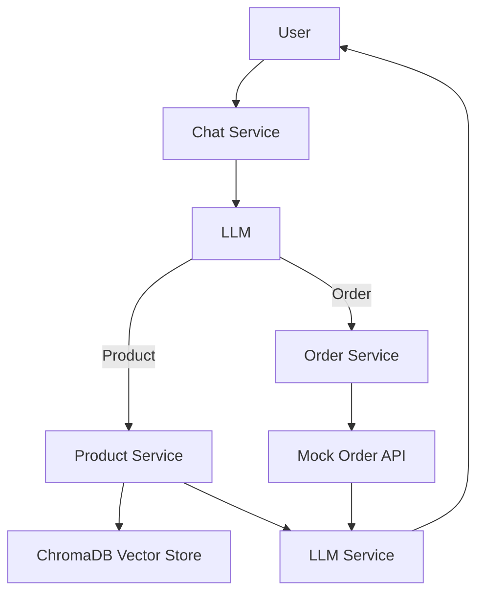

# E-Commerce Assistant System

## 🚀 Overview
A containerized microservice architecture that handles product searches and order inquiries through conversational AI, combining rule-based routing with LLM intelligence.

## Microservices Overview

chat_service: Routes queries to product, order, or LLM services

product_search_service: Semantic product search via ChromaDB + MiniLM

order_lookup_service: Parses structured queries and summarizes results

mock_api_service: Serves order data (e.g., /data/customer/{id})

llm_service: Local or remote model (e.g., Mistral 7B) for classification & summarization

## 🏗️ Architecture

🧪 Testing Instructions

🔁 Chat with the Assistant

📦 Product Search

curl -X POST http://IP:8000/chat \
  -H "Content-Type: application/json" \
  -d '{"query": "What are the top rated guitar products?"}'

curl -X POST http://IP:8000/chat \
  -H "Content-Type: application/json" \
  -d '{"query": "cheap acoustic guitar strings"}'

🧾 Order Search

curl -X POST http://IP:8000/chat \
  -H "Content-Type: application/json" \
  -d '{"query": "What are the details of my last order?"}'

Then reply:
curl -X POST http://IP:8000/chat \
  -H "Content-Type: application/json" \
  -d '{"query": "My customer id is 37077"}'

## Implementation Summary
All services are containerized using Docker Compose, and the system consists of modular microservices that communicate via HTTP.

Query Routing
The chat_service forwards user queries to the appropriate backend service.

Routing is based on keyword rules and zero-shot classification using an LLM.

Product Service
Uses ChromaDB with all-MiniLM-L6-v2 sentence embeddings.

Performs dense semantic retrieval to identify relevant product information.

Order Service
Constructs prompts to help the LLM identify the correct API endpoint (e.g., /data/customer/{id}).

Sends requests to the mock API based on LLM-selected endpoints.

Mock API
Exposes a structured dataset of historical order records.

Returns data from requested endpoints based on customer ID, category, or priority.

LLM Service
Classifies query intent (product or order).

Determines the best matching API endpoint from user queries and history.

Summarizes structured API data into conversational responses.

## Deployment

Launch EC2 instance

Install Docker and Docker Compose:
```bash
sudo apt update && sudo apt install docker.io docker-compose -y
Clone this repo and run:
docker-compose up --build
Access your assistant at:
http://IP:8000/chat
```

## Running Locally

Getting model file
  If you need model locally
    Run the following commands
    1. chmod +x download_model.sh
    2. ./download_model.sh
  Otherwise, get API from third party companies like openrouter

  Start services in different terminals:

```bash


cd chat_service
uvicorn main:app --port 8000

cd product_search_service
uvicorn main:app --port 8001

cd order_lookup_service
uvicorn main:app --port 8002
uvicorn mock_api:app --port 8005

cd llm_service
uvicorn main:app --port 8003


Query via curl:
curl -X POST http://localhost:8000/chat -H "Content-Type: application/json" -d '{"query": "What are the top-rated guitar strings?"}'

See [sample_interactions.md](./sample_interactions.md) for example chatbot queries and responses.
```
